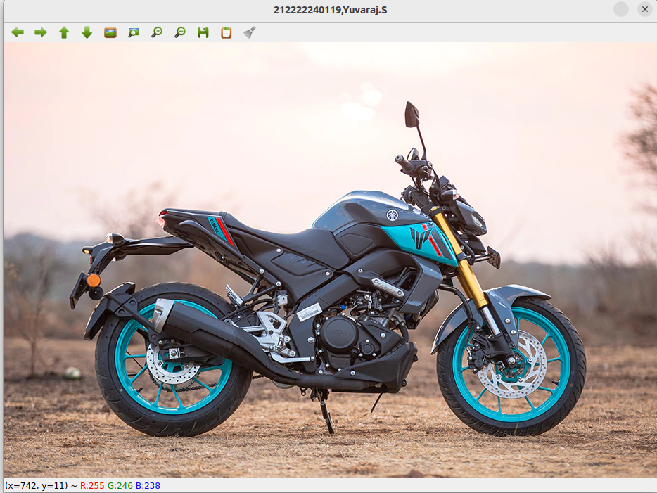
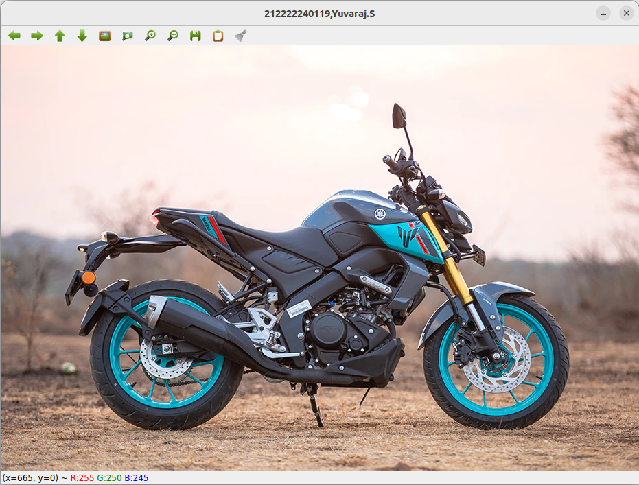
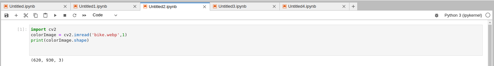
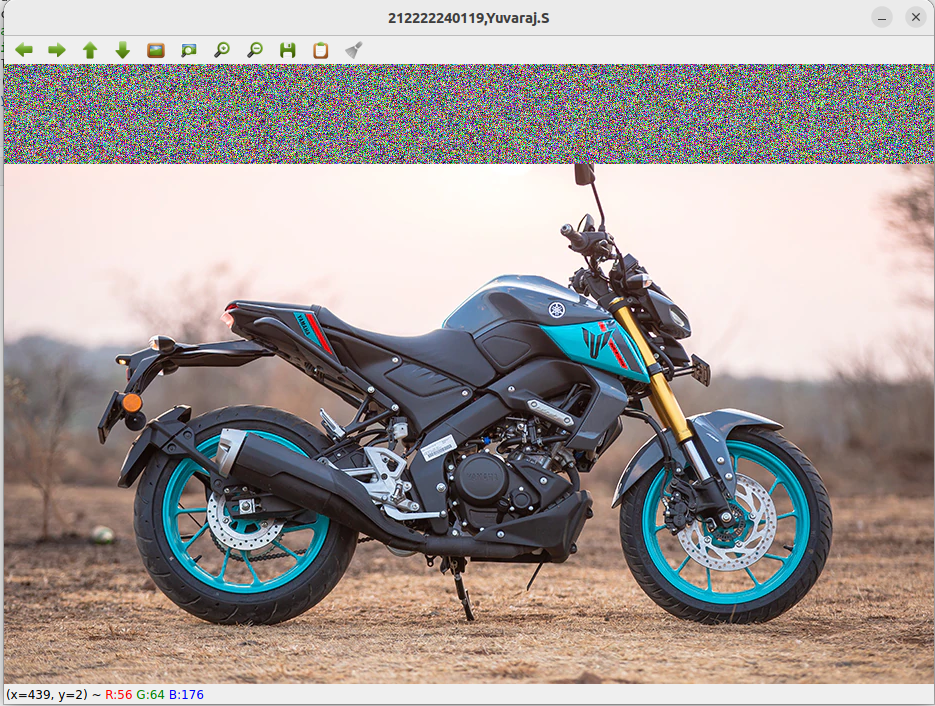
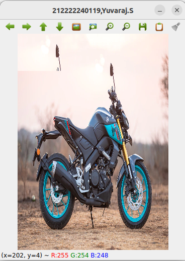

# READ AND WRITE AN IMAGE
## AIM
To write a python program using OpenCV to do the following image manipulations.
i) Read, display, and write an image.
ii) Access the rows and columns in an image.
iii) Cut and paste a small portion of the image.

## Software Required:
Anaconda - Python 3.7
## Algorithm:
### Step1:
Choose an image and save it as a filename.jpg
### Step2:
Use imread(filename, flags) to read the file.
### Step3:
Use imshow(window_name, image) to display the image.
### Step4:
Use imwrite(filename, image) to write the image.
### Step5:
End the program and close the output image windows.
## Program:
### Developed By: Yuvaraj.S 
### Register Number: 22008589
## i) To Read,display the image
```python
Developed by: Yuvaraj.S
Register Number: 22008589
import cv2
colors_img=cv2.imread('bike.webp',1)
cv2.imshow('212222240119,Yuvaraj.S',colors_img)
cv2.waitKey(0)
```
## ii) To write the image
```python
Developed by: Yuvaraj.S
Register Number: 22008589
import cv2
color_img=cv2.imread('bike.webp',1)
w=cv2.imwrite('1.png',color_img)
cv2.imshow('212222240119,Yuvaraj.S',color_img)
cv2.waitKey(0)
```
## iii) Find the shape of the Image
```python
Developed by: Yuvaraj.S
Register Number: 22008589
import cv2
colorImage = cv2.imread('bike.webp',1)
print(colorImage.shape)
```
## iv) To access rows and columns

```python
Developed by: Yuvaraj.S
Register Number: 22008589
import cv2
import random
color_img=cv2.imread('bike.webp',1)
for i in range(100):
    for j in range(color_img.shape[1]):
        color_img[i][j]=[random.randint(0,255),random.randint(0,255),random.randint(0,255)]
cv2.imshow('212222240119,Yuvaraj.S',color_img)
cv2.waitKey(0)
```
## v) To cut and paste portion of image
```python
Developed by: Yuvaraj.S
Register Number: 22008589
import cv2
color_img = cv2.imread('bike.webp',1)
color_img = cv2.resize(color_img, (300, 430))
color_img[500:550,500:550]=[0,0,0]
cut= color_img[37:111,108:195]
color_img[0:74,0:87]=cut
cv2.imshow('212222240119,Yuvaraj.S',color_img)
cv2.waitKey(0)
```

## Output:

### i) Read and display the image



### ii)Write the image



### iii)Shape of the Image



### iv)Access rows and columns



### v)Cut and paste portion of image



## Result:
Thus the images are read, displayed, and written successfully using the python program.


